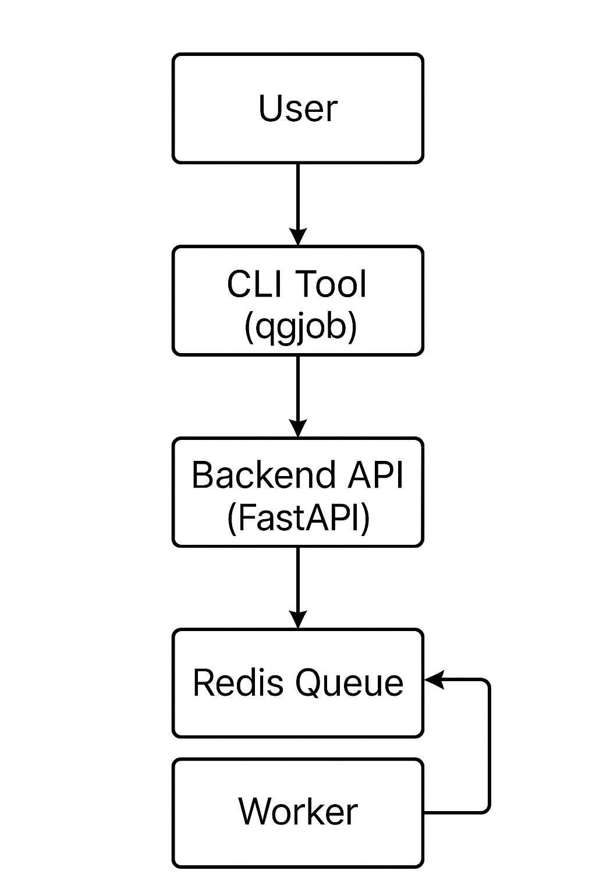

# QualGent Backend Coding Challenge

## Overview

A modular, scalable test automation system—complete with:
- A Python CLI tool (`qgjob`)
- A FastAPI backend server
- Redis-powered job queueing/grouping logic
- GitHub Actions workflow for CI/CD

---

## Architecture



**Core Principles:**
- **Modular**: Clear separation between CLI, backend API, and queue logic
- **Efficient**: Batches jobs by app version for optimal device reuse
- **Scalable**: Ready for horizontal scaling and multiple agents
- **Developer Friendly**: Simple CLI UX, clear docs, and CI integration

---

## Setup & Running

### Prerequisites
- Python 3.12+
- Redis (Docker recommended)

### Clone & Install
```sh
git clone <your-repo>
cd qualgent-challenge
pip install -r backend/requirements.txt
pip install -r cli_tool/requirements.txt


# QualGent Test Orchestrator

A modular, scalable backend and CLI solution for orchestrating AppWright end-to-end tests across local devices, emulators, and BrowserStack.

---

## Overview

This project provides:
- **A Python CLI tool (`qgjob`)** to submit and track test jobs.
- **A FastAPI backend** to queue, group, and schedule jobs by app version, with Redis as a fast in-memory queue.
- **GitHub Actions workflow** for seamless CI integration.
- **Extensible architecture** ready for scaling, prioritization, and retries.

---

## Architecture


- **CLI Tool**: User-facing interface to submit/check test jobs.
- **Backend (FastAPI)**: Receives jobs, batches/group jobs by `app_version_id`, tracks status.
- **Redis**: Efficient queue for jobs, supports grouping and batching.
- **Worker/Agent**: (Simulated) picks up jobs, runs tests, and updates status.

---

## Setup & Running

### Prerequisites
- Python 3.12+
- [Redis](https://redis.io/download) (Docker recommended)

### Installation

1. **Clone the repo:**
    ```sh
    git clone https://github.com/<your-username>/<repo-name>.git
    cd <repo-name>
    ```

2. **Install Python dependencies:**
    ```sh
    pip install fastapi uvicorn redis click requests
    ```

3. **(Optional) Use requirements files:**
    ```sh
    pip install -r backend/requirements.txt
    pip install -r cli_tool/requirements.txt
    ```

4. **Start Redis (recommended with Docker):**
    ```sh
    docker run -p 6379:6379 redis
    ```

---

### Running the Backend

```sh
cd backend
uvicorn main:app --reload
